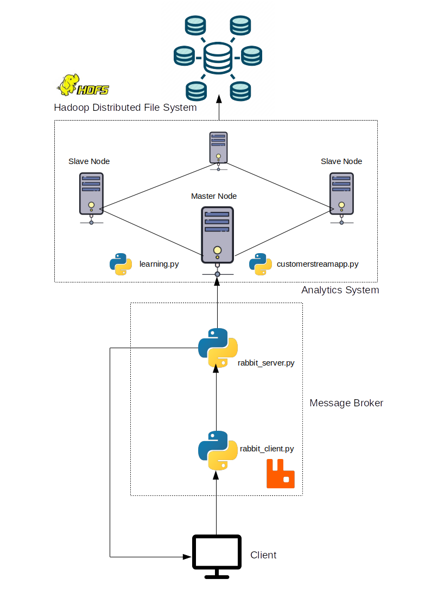

# Assignment 3 - Report

### Big Data Platforms - CS-E4640

---

### Part 1

##### 1. Select a dataset suitable for streaming analytics for a customer as a running example (thus the basic unit of the data should be a discrete record/event data). Explain the dataset and at least two different analytics for the customer: (i) a streaming analytics which analyzes streaming data from the customer (customerstreamapp) and (ii) a batch analytics which analyzes historical results outputted by the streaming analytics. The explanation should be at a high level to allow us to understand the data and possible analytics so that, later on, you can implement and use them in answering other questions.

We have used `2018_Yellow_Taxi_Trip_Data.csv` file as an experimental dataset for this assignment. The yellow and green taxi trip records include fields capturing pick-up and drop-off dates/times, pick-up and drop-off locations, trip distances, itemized fares, rate types, payment types, and driver-reported passenger counts. The data used in the attached datasets were collected and provided to the NYC Taxi and Limousine Commission (TLC) by technology providers authorized under the Taxicab & Livery Passenger Enhancement Programs (TPEP/LPEP). The trip data was not created by the TLC, and TLC makes no representations as to the accuracy of these data. The attributes present in this dataset are VendorID, tpep_pickup_datetime, tpep_dropoff_datetime, Passenger_count, Trip_distance, PULocationID, DOLocationID, RateCodeID, Store_and_fwd_flag, Payment_type, Fare_amount, MTA_tax, Improvement_surcharge, Tip_amount, Tolls_amount, Total_amount. It is a quite large dataset which is ideal for this experiment.

i) For Streaming Analytics, the fare amount is predicted using Linear Regression and sent back to client. This helps the customers to avoid being overcharged due to a pre calculated fare-range. The attributes, `'VendorID', 'passenger_count', 'trip_distance', 'RatecodeID'` have been used to perform Regression

ii) For Batch Analytics, the `PULocationID` attribute has been used to determine the frequency of bookings made from a particular location that helps the taxi drivers to understand the places where the booking demand is high.

##### 2. Customers will send data through message brokers/messaging systems which become data stream sources. Discuss and explain the following aspects for the streaming analytics: (i) should the analytics handle keyed or non-keyed data streams for the customer data, and (ii) which types of delivery guarantees should be suitable.

i) Only the keyed data is handled by this analytics. The keyed nature of attributes are verified by a message. Usage of non-keyed data can lead to errors in case there are too many missing non-keyed attributes.
ii) RabbitMQ maintains a message queue that is configured to resend the undelivered messages with a redelivered flag in order to make it clear to the client that this message was resent because the previous message was undelivered due to network failures. Acknowledgment message is sent from the client to customer, indicating that the previous message was received. The server raises an exception in case there are any keyed attributes are missing from the message resulting in suspension of data ingest at that very point. This RabbitMQ is a reliable message broker that efficiently gurantees the delivery.

##### 3. Given streaming data from the customer (selected before). Explain the following issues: (i) which types of time should be associated with stream sources for the analytics and be considered in stream processing (if the data sources have no timestamps associated with events, then what would be your solution), and (ii) which types of windows should be developed for the analytics (if no window, then why). Explain these aspects and give examples.

i) There are two attributes namely, `tpep_pickup_datetime` and `tpep_dropoff_datetime` that contain the timestamps of pickup and dropoff. This data is sent along with the message so that the Rabbit server can understand how old is the data. As per the validation function, messages with older timestamps that are probably duplicate messages, will be ignored considering the time needed for a new message from the client, to reach the server is negligible.

ii) The Analytics are performed as soon as each message is received on every tuple of the keyed data that are sent along with the message. Creating a window would result in batching that in turn will delay the analytics. Therefore, there are no Windows implemented on streaming Analytics.

##### 4. Explain which performance metrics would be important for the streaming analytics for your customer cases.

There are mainly three categories of performance metrics involved: -

i) Upload performance is calculated on the basis of time taken by the client to push new messages into the message-queue of the message broker.. This is the most important performance metric usually handled by scaling up, scaling down and micro-batching of large data in order to avoid bottlenecks.

ii) Ingestion performance is calculated on the basis of time taken by RabbitMQ to push data into HDFS big data platform which is also capable of creating bottlenecks.

iii) Analytics performance is calculated on the basis of time taken to run Linear Regression on every message. This is considered to be the biggest source of bottleneck in the server side as this process consumes more computational resources and should be tracked carefully after configuring Spark to handle large amount of data.

##### 5. Provide a design of your architecture for the streaming analytics service in which you clarify: customer data sources, mysimbdp message brokers, mysimbdp streaming computing service, customer streaming analytics app, mysimbdp-coredms, and other components, if needed. Explain your choices of technologies for implementing your design and reusability of existing assignment works. Note that the result from customerstreamapp will be sent back to the customer in near real-time.

Following diagram shows the overall design of this system.

The Client system is the customer data source that accepts the dataset and runs `rabbit_client.py` which processes the csv file and sends new message in keyed format to the message broker which is implemented in `rabbit_server.py`. RabbitMQ has been used as the mysimbdp message broker which is very reliable, flexible and has been used in the previous assignment also.
The Stream Analytics has been built using Spark and Hadoop which are extremely capable of handling large volumes of data and provide excellent performance features. This cluster is managed by Yarn and hosted on a Google Cloud Platform having one master node and several slave node, using the Google Compute Engine to run `customerstreamapp.py` and `learning.py`. `customerstreamapp.py` receives the message and decodes the key attributes so that `pySpark` can use `VectorAssembler` to predict the output. Finally the predicted output is sent back to `rabbit_client.py` and the data is stored into the HDFS which is very compatible with Spark-Yarn combination and serves as the `mysimbdp-coredms`.

### Part 2

##### 1. Explain the implemented structures of the input streaming data and the output result, and the data serialization/deserialization, for the streaming analytics application (customerstreamapp) for customers.

Spark is the analytics platform used here that accepts the streaming data and performs quality checks then proceeds to de-serialize the JSON format into pandas, in order to match the order of attributes present in the HDFS and append to the existing data. The excess attributes that are non necessary, are removed and then processed by the Linear Regression model so as to obtain a predicted fare. The predicted data is serialized and sent to the client as a message by RabbitMQ.

##### 2. Explain the key logic of functions for processing events/records in customerstreamapp in your implementation.

`pyspark.ml.regression` library is implemented to use Linear Regression to predict the fare and send it back to the client as a pre-calculated fare so that the customers to have a rough idea about the fare costs and avoid getting overcharged. The attributes, `'VendorID', 'passenger_count', 'trip_distance', 'RatecodeID'` have been used to perform Regression.

### Part 3

##### 1. If you would like the analytics results to be stored also into mysimbdp-coredms as the final sink, how would you modify the design and implement this (better to use a figure to explain your design).

The output obtained after processing the Regression Model is pushed to HDFS by appending into the existing data. In this case, there is a new attribute `predicted_fare` gets appended to the existing table as a new column, either automatically or by the involvement of the client where the output gets sent back through RabbitMQ so that the client can use `dataingest` to push the new output into `mysimbdp-coredms`.

##### 2. Given the output of streaming analytics stored in mysimbdp-coredms for a long time. Explain a batch analytics (see also Part 1, question 1) that could be used to analyze such historical data. How would you implement it?

Batch analytics require the definition of a Window that collects a batch of incoming messages over a certain period of time and later on perform programmed analysis over the aggregated data stored in HDFS. In this case the data captured in a window can be used to compare the total earnings of taxi-drivers , high-demand locations, active-inactive patterns etc. In other words Batch analytics can be used to calculate a tentative overall profit made by the industry.

##### 3. Assume that the streaming analytics detects a critical condition (e.g., a very high rate of alerts) that should trigger the execution of a batch analytics to analyze historical data. How would you extend your architecture in Part 1 to support this (use a figure to explain your work)?

In this case there will be a separate program that detects a critical condition as it will be constantly listening to a dedicated alert-topic that sends a message to trigger the automatic start of batch analytics. It is the responsibility of the `Master` node to raise the alert and send the message to RabbitMQ simultaneously aggregating the data within a specified window in order to prepare a data-pool for batch analytics.

In this case the design would be modified slightly to create a dedicated connection between the `master` node and the `Client`.

##### 4. If you want to scale your streaming analytics service for many customers and data, which components would you focus and which techniques you want to use?

The easiest way to scale this system is by creating multiple `slave` nodes in order to increase availability of resources for parallel processing of data in case there are a huge number of clients trying to access the `master` node or the size of data ingesting through the client is very big. Google Cloud Platform provides auto-scaling services that can be configured to dynamically create multiple instances during heavy demand and even destroy the instances when they are not in use.
RabbitMQ also can be scaled by increasing the number of message queues that speeds up the ata ingestion process and prevent bottlenecks from happening by performing load balancing checks that are implemented in the previous assignment.

##### Is it possible to achieve end-to-end exactly once delivery in your current implementation? If yes, explain why. If not, what could be conditions and changes to make it happen? If it is impossible to have end-to-end exactly once delivery in your view, explain why.

In the current implementation, RabbitMQ sends a message to the client and receives an acknowledgment and then refrains from re-sending the same message. In case of network failure, there is no acknowledgment so messages are still in the queue and re-sent with a `flag`, resulting in the client receiving duplicate messages after the network resumes activity. In case of a heavy demand scenario when a huge number of clients are accessing the server, there are multiple message queues holding different messages, and one message cannot be placed in multiple queues hence due to this congestion, there is a possibility that a message gets lost which means never received by the client. Therefore, end-to-end exactly once delivery is not possible to achieve.
